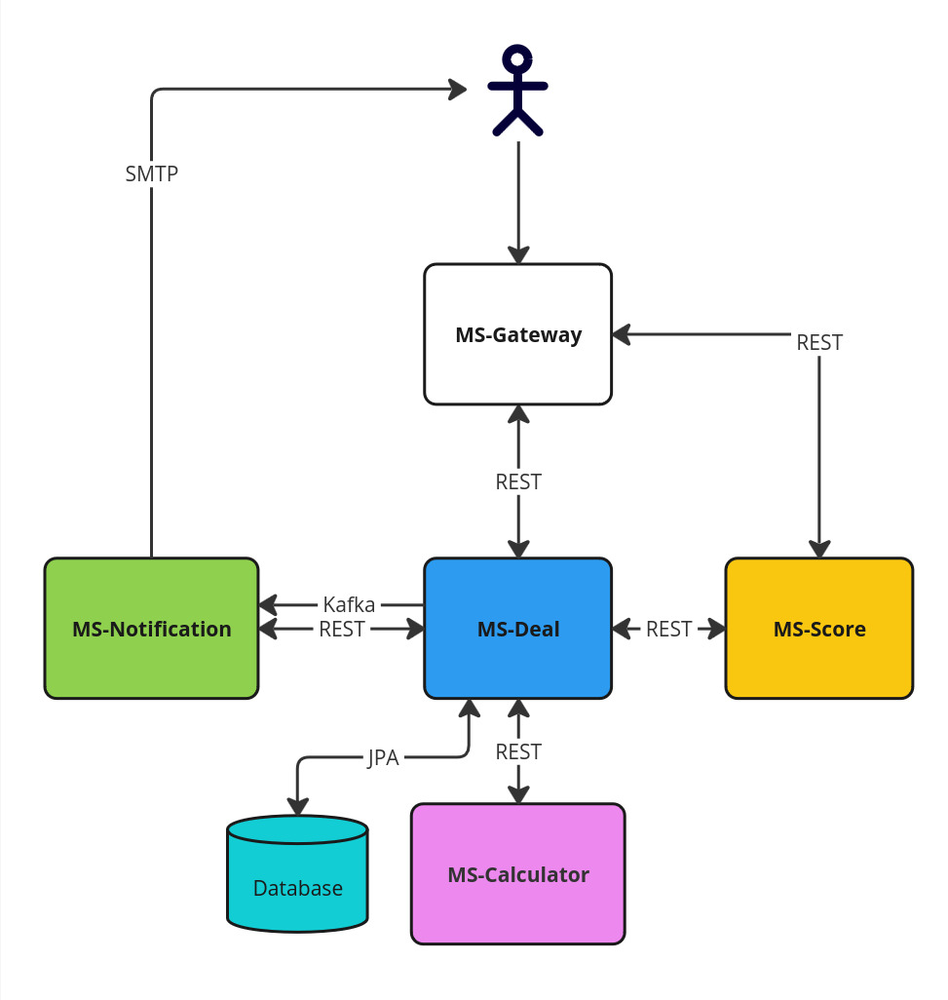

# Кредитный конвейер
[](https://sonarcloud.io/summary/new_code?id=futind_LoanIssuer) [](https://sonarcloud.io/summary/new_code?id=futind_LoanIssuer) [](https://sonarcloud.io/summary/new_code?id=futind_LoanIssuer) [](https://codecov.io/gl/futind/LoanIssuer)
## Описание проекта

Курсовой проект для компании **Neoflex**: бэкенд-приложение с микросервисной архитектурой — прототип кредитного конвейера.

### Используемые технологии

- **Backend**: Java, Spring Boot, Lombok
- **База данных**: PostgreSQL (Spring Data JPA, Liquibase)
- **Сообщения**: Kafka
- **Документация API**: Swagger
- **Контейнеризация**: Docker, Docker Compose
- **CI/CD**: GitLab CI (сборка, тестирование, CodeCov, SonarCloud)

## Архитектура

Проект построен по микросервисной архитектуре и включает следующие модули:

| Модуль            | Описание                                                                     |
| ----------------- | ---------------------------------------------------------------------------- |
| **MS-Calculator** | Скоринг, расчёт кредитных параметров и графика кредита (аннуитетный платёж). |
| **MS-Statement**  | Сервис прескоринга клиента, взаимодействует с MS-Deal.                       |
| **MS-Deal**       | Управление ходом сделки, хранение данных о клиенте и кредите.                |
| **MS-Dossier**    | Оповещение клиента по email.                                                 |
| **MS-Gateway**    | API-шлюз для взаимодействия с клиентом.                                      |

### Схема проекта



## Запуск

### 1. Клонирование репозитория

```sh
git clone git@github.com:futind/LoanIssuer.git
cd LoanIssuer
```

### 2. Настройка переменных окружения

#### В корне репозитория создайте `.env` и добавьте:

```ini
DATABASE_NAME=your_database_name
DATABASE_USER=your_db_user
DATABASE_PASSWORD=your_db_password
DATABASE_PORT=your_db_port
KAFKA_PORT=your_kafka_port
```

#### В папке `MS-Deal` создайте `.env.properties`:

```ini
database.host=your_db_host
database.port=your_db_port
database.user=your_db_user
database.password=your_db_password
kafka.host=your_kafka_host
kafka.port=your_kafka_port
```

#### В папке `MS-Dossier` создайте `.env.properties`:

```ini
mail.host=smtp.example.com
mail.port=587
mail.username=your_email@example.com
mail.password=your_password
kafka.host=your_kafka_host
kafka.port=your_kafka_port
```

### 3. Запуск проекта в Docker

```sh
docker-compose up -d
```

После успешного запуска сервисы будут доступны по настроенным портам.

---

📌 **Автор:** Футин Даниил

🔗 **Ссылки:** [SonarCloud](https://sonarcloud.io/summary/new_code?id=futind_LoanIssuer) | [Codecov](https://codecov.io/gl/futind/LoanIssuer)

